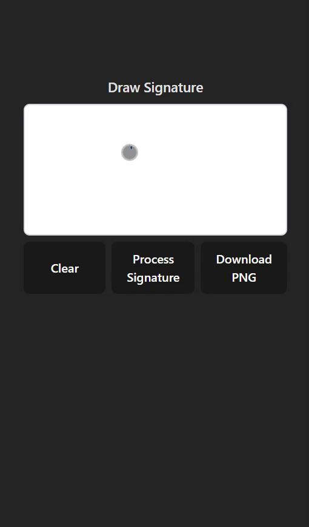

# ✨ 3D Signature ✨

I was inspired by the Macbook's "Hello" screen saver, so I thought "Hmmmmm can this animation be applied to personal signatures? Can I have a animation of my own screen saver just running in the background?" No, I can't. Not yet at least I haven't added a download function (lol). Hopefully one of the projects that I keep incrementing on with minor weekly updates cause well, frankly, it doesn't look pretty right now, and that pisses me off (lol).


## Demo 🎥




## Features 🌟

- Download clean background PNG of your signature
- Observe 3D model of signature


## Run Locally 💻

Clone the project

Install dependencies

```bash
  npm install
```

Start the server

```bash
  npm run dev
```


## Roadmap 🐾

- On-repeat animation option
- Download animation as gif
- Download 3D model render
- Signature + Background color options
- MAKING THE WHOLE THING LOOK PRETTIER MY GOSH

